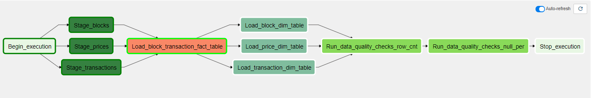

# Capstone Project for Udacity's Data Engineering Nanodegree

## About 

The data sources, for this project, were collected from Google Cloud Platform with BigQuery. A data pipeline, two data sources, was create for the Ethereum classic blockchain, i.e., blocks and transactions. All blocks and transactions in 2020 were collected.

Blocks are batches of transactions with a hash of the previous block in the chain. ... This prevents fraud, because one change in any block in history would invalidate all the following blocks as all subsequent hashes would change and everyone running the blockchain would notice.

An Ethereum transaction refers to an action initiated by an externally-owned account, in other words an account managed by a human, not a contract. ... If a contract account, the transaction will execute the contract code) signature – the identifier of the sender.

## File Directory Description

airflow/: ETL

push_data_s3.py: Upload to S3

red_shift_create_tables.sql: Redshift create table statements

bigquery_data_collection.py: BigQuery data collection

## Purpose

The purpose of this data pipeline is to create a dashboard.

Dashboard Elements:

1. Number of Large Transactions
2. Daily Active Addresses
3. Total Addresses
4. Ownership by Time Held
5. Transactions Made by Miners

This dashboard could be helpful to someone looking to invest in crypto currency. The number of large transactions can be a useful to find large investments in the crypto currency. Similarly, the number of active addresses can be used to determined how the crypto currency is growing in popularity.  It might also be interesting to see the transactions that crypto miners make.

## Data Model

A star-schema data warehouse was used represent the historical blocks and transactions. The fact table has all transactions and important block-level information, such as, miner address. This fact table allows for quick analytical drill downs, and it is useful for creating dashboards.

I collected ethereum prices from here: https://www.kaggle.com/prasoonkottarathil/ethereum-historical-dataset because I could not find an api that generated hourly historical prices for 2020.

The daily raw data was stored in S3 in CSV format and partitioned on date:

block data: s3://rk-blockchain-db/block/YEAR/MONTH/DAY.csv

transaction data: s3://rk-blockchain-db/transaction/YEAR/MONTH/DAY.csv

price data: s3://rk-blockchain-db/price/YEAR/MONTH/DAY.json

** Note: Both data formats are CSVs, the data was initially collected via an API with BigQuery. With more time, I could add this to the data pipeline.

## Block Data Dictionary

| Field name        | Type      | Mode     | Description                                                          |   |
|-------------------|-----------|----------|----------------------------------------------------------------------|:-:|
| timestamp         | TIMESTAMP | REQUIRED | The timestamp for when the block was collated                        |   |
| number            | INTEGER   | REQUIRED | The block number                                                     |   |
| hash              | STRING    | REQUIRED | Hash of the block                                                    |   |
| parent_hash       | STRING    | NULLABLE | Hash of the parent block                                             |   |
| nonce             | STRING    | REQUIRED | Hash of the generated proof-of-work                                  |   |
| sha3_uncles       | STRING    | NULLABLE | SHA3 of the uncles data in the block                                 |   |
| logs_bloom        | STRING    | NULLABLE | The bloom filter for the logs of the block                           |   |
| transactions_root | STRING    | NULLABLE | The root of the transaction trie of the block                        |   |
| state_root        | STRING    | NULLABLE | The root of the final state trie of the block                        |   |
| receipts_root     | STRING    | NULLABLE | The root of the receipts trie of the block                           |   |
| miner             | STRING    | NULLABLE | The address of the beneficiary to whom the mining rewards were given |   |
| difficulty        | NUMERIC   | NULLABLE | Integer of the difficulty for this block                             |   |
| total_difficulty  | NUMERIC   | NULLABLE | Integer of the total difficulty of the chain until this block        |   |
| size              | INTEGER   | NULLABLE | The size of this block in bytes                                      |   |
| extra_data        | STRING    | NULLABLE | The extra data field of this block                                   |   |
| gas_limit         | INTEGER   | NULLABLE | The maximum gas allowed in this block                                |   |
| gas_used          | INTEGER   | NULLABLE | The total used gas by all transactions in this block                 |   |
| transaction_count | INTEGER   | NULLABLE | The number of transactions in the block                              |   |

## Transaction Data Dictionary

| Field name                  | Type      | Mode     | Description                                                                              |   |
|-----------------------------|-----------|----------|------------------------------------------------------------------------------------------|:-:|
| hash                        | STRING    | REQUIRED | Hash of the transaction                                                                  |   |
| nonce                       | INTEGER   | REQUIRED | The number of transactions made by the sender prior to this one                          |   |
| transaction_index           | INTEGER   | REQUIRED | Integer of the transactions index position in the block                                  |   |
| from_address                | STRING    | REQUIRED | Address of the sender                                                                    |   |
| to_address                  | STRING    | NULLABLE | Address of the receiver. null when its a contract creation transaction                   |   |
| value                       | NUMERIC   | NULLABLE | Value transferred in Wei                                                                 |   |
| gas                         | INTEGER   | NULLABLE | Gas provided by the sender                                                               |   |
| gas_price                   | INTEGER   | NULLABLE | Gas price provided by the sender in Wei                                                  |   |
| input                       | STRING    | NULLABLE | The data sent along with the transaction                                                 |   |
| receipt_cumulative_gas_used | INTEGER   | NULLABLE | The total amount of gas used when this transaction was executed in the block             |   |
| receipt_gas_used            | INTEGER   | NULLABLE | The amount of gas used by this specific transaction alone                                |   |
| receipt_contract_address    | STRING    | NULLABLE | The contract address created, if the transaction was a contract creation, otherwise null |   |
| receipt_root                | STRING    | NULLABLE | 32 bytes of post-transaction stateroot (pre Byzantium)                                   |   |
| receipt_status              | INTEGER   | NULLABLE | Either 1 (success) or 0 (failure) (post Byzantium)                                       |   |
| block_timestamp             | TIMESTAMP | REQUIRED | Timestamp of the block where this transaction was in                                     |   |
| block_number                | INTEGER   | REQUIRED | Block number where this transaction was in                                               |   |
| block_hash                  | STRING    | REQUIRED | Hash of the block where this transaction was in                                          |   |

## Price Data Dictionary

| Field name | Type       | Mode     | Description                                   |   |
|------------|------------|----------|-----------------------------------------------|:-:|
| timestamp  | TIMESTAMP  | REQUIRED | The timestamp for when the block was collated |   |
| open       | NUMERIC    | NULLABLE | The block number                              |   |
| high       | NUMERIC    | NULLABLE | Hash of the block                             |   |
| low        | NUMERIC    | NULLABLE | Hash of the parent block                      |   |
| close      | NUMERIC    | NULLABLE | Hash of the generated proof-of-work           |   |
| volume     | NUMERIC    | NULLABLE | SHA3 of the uncles data in the block          |   |

## Data Pipeline

Airflow was used to schdule an ETL from S3 into Redshift. The data was first copied to staging tables, and the post-processing was done in Redshift during the transform phase. Data quality checks were performed after the ETL.

Backfilling was enabled in the DAG with catchup=True. The data was copied to redshift by month using the backfilling process. AWS and Redshift hooks configured in Airflow as well. A maximum of 3 "retries" were performed during the execution.

## Data Quality Checks

I included two data quality checks: 1) ensure that there are records present in all fact and dimension tables and 2) ensure that there are <90% null values for each column in the fact table.

## Data Cleaning

The dates needed to be converted to TIMESTAMP because the CSV files only have text data. The next issue was the length of some of the numeric fields. The value was represent in WEI which could have more than 25 digits,  and this is larger than the maximum size for redshift. I needed to load these fields as text and then used custom post-processing to convert them to numeric. I used a X 9 multipler to represent this data. Some of the data elements, such as INPUT in the transaction table, had over 10,000 bytes. I excluded this field to save space.

## Hypothetical Scenarios

### Data increased by 100 x

The data is partitioned by year and month. If the data was increased by x 100, the current data pipeline would be able to adequently handle it. The storage in the AWS Redshift cluster can also be scaled-up.

The S3 data can be accessed and processed by multiple users without incurring much cost. The data could be replicated across regions for availability.

### The pipelines would be run on a daily basis by 7 am every day.

Airflow has a scheduler that allows for job to be scheduled with CRON style commands. 

### The database needed to be accessed by 100+ people

If multiple users need to access the databse at once, the number of cores/compute, in the AWS Redshift cluster, can also be scaled-up.
